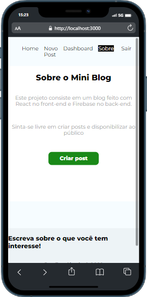

# Mini Blog Fullstack

Este projeto consiste em um blog feito com React no front-end e Firebase no back-end.
(https://github.com/facebook/create-react-app).

## CRUD

Funções Disponíveis

### `Ler Posts`

Leia os posts disponíveis na página inicial\

### `Criar Posts`

Neste Blog, tens a possibilidade de ser um leitor e criador de conteúdos para o público

### `Atualizar Posts`

Atualize os teus posts quantas vezes forem necessárias, eles sempre estarão disponíveis no teu `Dashboard`

 

### `Deletar`

**Delete os teus posts num estalar de dedos**

## Saiba Mais Sobre o Blog

  

<h2 id="resultados">Resultados de Desenvolvimento</h2> 
 

   
  
  
    
    
    

 
    
 
 
  [LinkedIn - Dionísio Braga](https://www.linkedin.com/in/dion%C3%ADsio-braga/) 
 
### Contribuição

Sinta-se livre em contribuir neste projeto.
